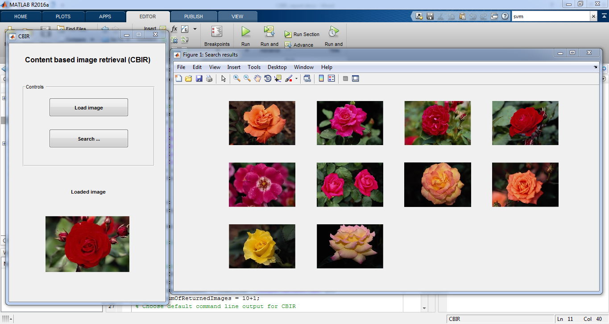
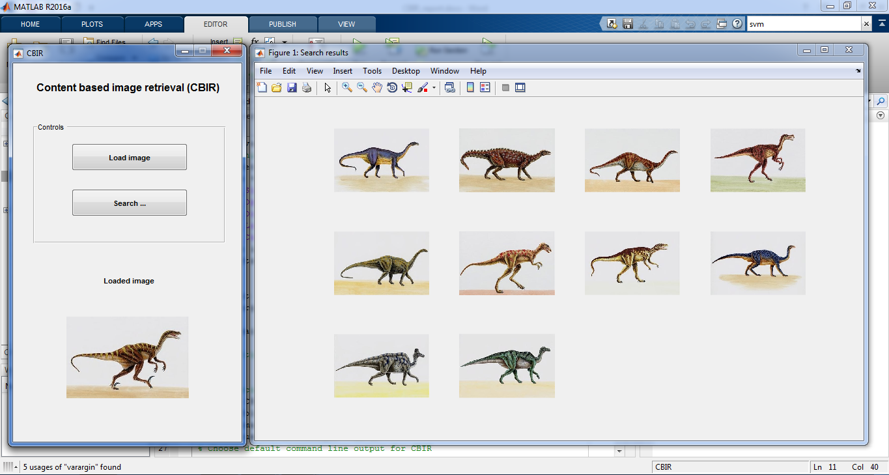
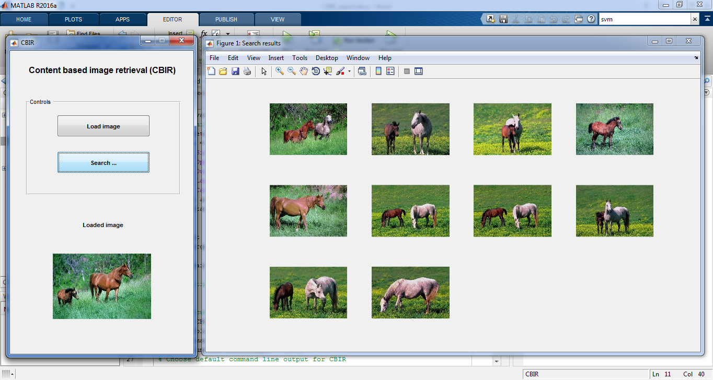

# **Content Based Image Retrieval Using MATLAB**

---

## Problem statement:
With the vast popularity of embedded camera devices and the continuous development of the internet technology, a noticeable growth in web sharing and photo browsing has been witnessed in the last decade. Hence came the emergence of great number of applications based on image search. Traditionally image search can rely on text search techniques as search engines index multimedia data based on its surrounding metadata information around a photo on the web such as titles and tags. Such indexing can be highly inefficient since text words can be inconsistent with the visual content. Attention is hence drawn to content based image retrieval (CBIR) which have achieved great advance in the last few years.
    
    
## Existing approaches:    
Content based visual retrieval, which is also known by query by image content (QBIC) and content based visual information retrieval (CBVIR) is a simple application of computer vision to the problem of search of visual content in large databases. The application, as defined, has to deal with two main challenges: the intention gap and the semantic gap. The intention gap can be defined as the difficulty to express the expected visual content that the user faces when using the query at hand, while the semantic gap refers to the difficulty of expressing rather complicated semantic concepts with rudimentary visual feature.

Three main issues must addressed when developing a CBIR algorithm:

1.   Image representation
2.   Image organization 
3.   And similarity measurement between images

Image representation will mainly depend on the platform used by the developer of the algorithm. It has however to satisfy the condition of being both descriptive and discriminative as it is expected to be as the algorithm will be only as efficient as its ability to distinguish similar and dissimilar images. 
The large visual database presents organization as a nontrivial but rather laborious task to address. Fortunately, CBIR has information retrieval successful approaches to look up to as several CBIR algorithms rely on the commonly used inverted file structure to index large scale visual database allowing scalable retrieval. On the other hand, hashing based techniques can also present an alternative approach for indexing.

Similarity measurement between images is also critical in developing a solid code. It should reflect the relevance in semantics which is highly contradicted by the semantic gap previously discussed. And though highly relying on both image representation and organization, image similarity measurement is based on the visual matching results with the aid of weighing schemes.

A general formulation of the basic framework of a visual search algorithm can be divided into two main stages: the off line stage and the online stage. The flowchart of a general CBIR algorithm is shown in figure 1.

**Fig.1: The general framework of content based image retrieval extracted from W. Zhou, H. Li and Q. Tian,” Recent Advances in Content-based Image Retrieval: A literature Survey”**

In this project, a CBIR algorithm will be developed using MATLAB as a platform where the program’s input will be a query image taken from the user to retrieve similar to the given photo as an output. The dataset where the output images will be retrieves is a local database with a number of 1000 photos. As previously discussed, the similarity measurement criteria can widely vary, in the project at hand however, the features that will be extracted from the image will be color based where the similarity will be histogram similarity. The developed code will be discussed in details along with the testing and evaluation of the results along with the comparison of the work at hand with competing systems and approaches.

## Project Idea:
 
As previously mentioned, the user will input an image for the program to retrieve similar images to the input from a local database of photos. The representation of the user input will be performed according to the color histogram feature where the HSV space is chosen. Each H (Hue), S (Saturation) and V (Value) component is uniformly quantized into 8, 2 and 2 bins with resulting dimensions of 32. 
 
HSV space was created in the seventies by graphic design researchers as an alternative representation of the RGB color model in the aim of having a closer model to the way the human eye perceive color making attributes. HSV is a cylindrical geometry with the Hue as their angular dimension. Red is at 0° passing through the green primary at 120°, the blue primary at 240°and merging black to red at 360°. The neutral or gray colors represent the vertical axis with a range starting at Value = 0 representing black at the bottom to Value = 1 representing white at the top. The additive primary and secondary colors as well as the linear mixtures between adjacent pairs of them, which are commonly called pure colors, represent the outer edge of the cylinder with saturation 1. Mixing these colors with either black or white separately will leave the saturation unchanged, but mixing them with the combination of both black and white will alter the saturation to values less than 1. The HSV is demonstrated in figure 2 and 3. 

**Fig. 2: An illustration of the Hue dimension**

**Fig. 3: The HSV space demonstrated**

The issues of image organization as well as the measurement of similarity between images has been previously discussed earlier in the report, hence we discuss the used strategy to accomplish these two tasks in our algorithm.
In multimedia retrieval, target images in the database- which is a finite local set in our case- are ranked by being assigned with a relevance score and returned to the user. Such relevance score is determined by the choice of the similarity measurement as “it can be defined either by measuring the distance between the aggregated feature vector of the image representation or from the perspective of voting from relevant visual feature matches.” [3]
The chosen approach was the distance measurement. In the algorithm, an image is represented into a fixed size vector as mentioned earlier and the content relevance is measured based on the normalized distance between the vectors of the aggregated features by the following formula

Where N is the number of features and both X and Y are the images being compared.

## Some findings:
It can be expected that the suggested approach of solely using the color histogram for the purpose of image representation is not enough to get a functional solid algorithm. Two dissimilar images could have similar representation if they happen to have similar color scheme. Hence comes the need to go beyond color histogram and use other features for presentation. In addition to color histogram, the following features were used:

* Color auto-correlogram where the image is quantized into 4×4×4 colors in RGB adding 64 more dimensions
* Color moments where the mean and standard deviation i.e. the first two moments from the R, G and B color channels are extracted adding 6 dimensions
* Gabor wavelet whose filters span four scales ( 0.05,0.1,0.2 and 0.4 ) and six orientations ( θo=0 and θn+1=π/6 ). The filters are applied to the image and the mean and standard deviation of the wavelet coefficient are used to form the feature vector resulting in the addition of 48 dimensions
* Wavelet moments as by the use of the mean and the standard deviation of the transform coefficient to form the feature vector when applying the wavelet transform to the 3-level decomposition. 40 dimensions are hence added.

The total of the features used will form a 190-dimensional feature vector that will increase the efficiency of the retrieval considerably. [4]

Other modifications can address the semantic gap previously discussed, but before considering those modifications, let us discuss the three main levels of queries in CBIR:
* The first level is retrieval by primitive features such as color, texture or regions our developed algorithm. At this level the user inputs a query as an example, simply stated, the user expects the program to find images similar to the one he inputs.
* The second level is retrieval of objects of specific kind recognized by derived features demanding a certain amount of logical implication. The user in this case would command the program to find an image of a specific object, say a dog.
* The third and final level is retrieval by abstract attributes demanding a high level of reasoning. To illustrate our point, the user might expect more specific outputs, so he could search for an image of not just a dog but a dog running or a dog eating.
* Both level 2 and 3 can be referred to as semantic level retrieval and the difference between these two levels and level one is what we previously defined as the semantic gap.

So to overcome this gap, two modifications were previously reported in literature:

### 1. Semantic feature layers:
The idea mainly relies on designing semantically related feature classes that depend on lower level including additional knowledge. Such design requires iterative refinement by relevance feedback.[1]
### 2. Object onthology:
Object onthology provides a qualitative definition of high level query concepts and such an approach is applied via some main steps: 

* Use object onthology to define high level concepts
* Use machine learning to link low level queries with high level concepts
* Introduce a relevance feedback loop to make sure that the program is on the right trach in parallel with the user’s intentions
* Generate semantic template to support high level retrieval
* Make use of both the query and the textual information obtained from the web during the search.[2]

## Coding and outputs:

The program is made with a GUI (graphical user interface) to be clear and easy to use. The images dataset which the search is made on are stored in a the folder “images”, the main GUI is coded in the two files “CBIR.fig” and”CBIR.m” but the process of features extraction is made by the code “Extract_features.m”.
First the query image is loaded at this point all the previously mentioned features are extracted from the image then it is shown in the main GUI platform under title “Loaded image”.
Then the extracted features are compares to the already saved and processed database where the distance between the query image and all images in the dataset is calculated.
Finally the nearest ten images to the query image are shown in the GUI named “Search results” as shown in the next examples made to test algorithm. 

##Verification and testing:
Some of the screen shots while testing the images showing the test image and retrieved Images :)

